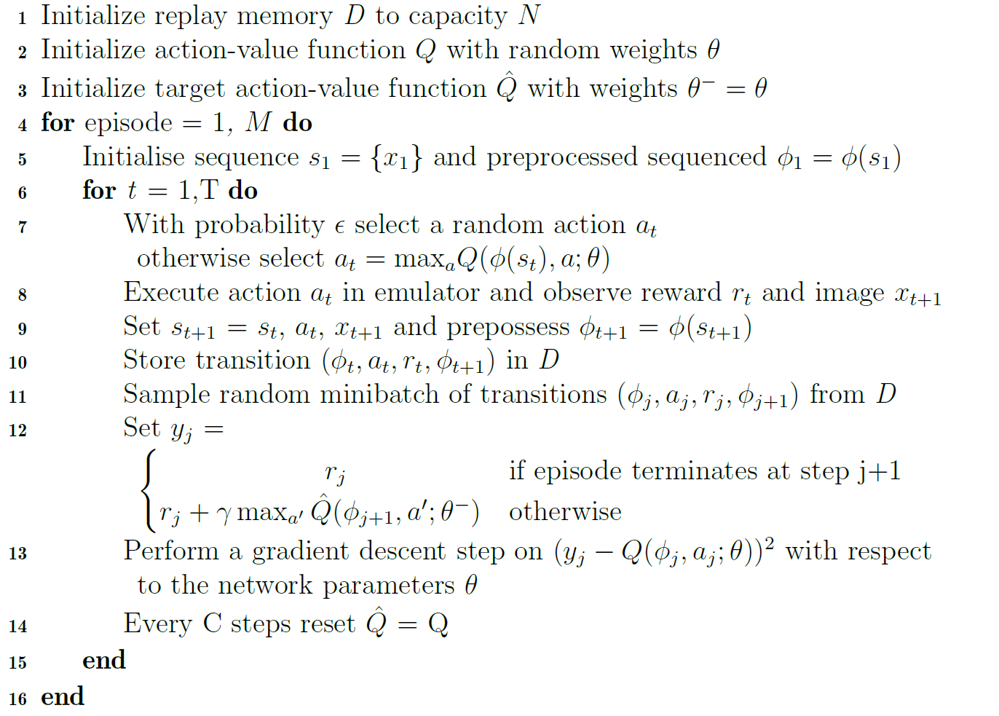

# DQN-PyTorch
DQN implementation using PyTorch for CartPole-v0 environment.

---
Algorithm
---

Deep Q-learning with Experience Replay [1]



---

For execution: Please go to the file location where main.py has been saved, and from the command line execute the below command.

Tested on Python 3.7.4

```
python main.py
```
---

Reference: https://deeplizard.com/learn/video/FU-sNVew9ZA

---

[1] Volodymyr Mnih, Koray Kavukcuoglu, David Silver, Andrei A Rusu, Joel Veness, Marc G Bellemare, Alex Graves, Martin Riedmiller, Andreas K Fidjeland, Georg Ostrovski, et al. Human-level control through deep reinforcement learning. nature, 518(7540):529-533, 2015.
